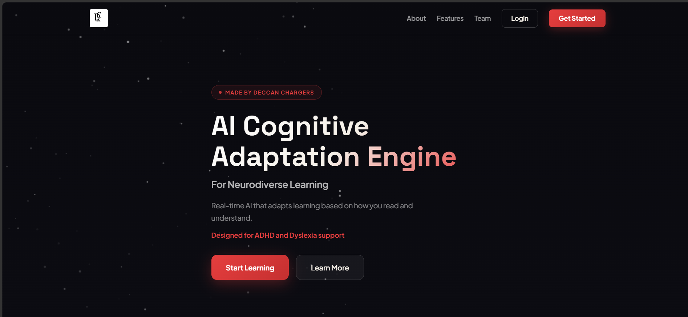
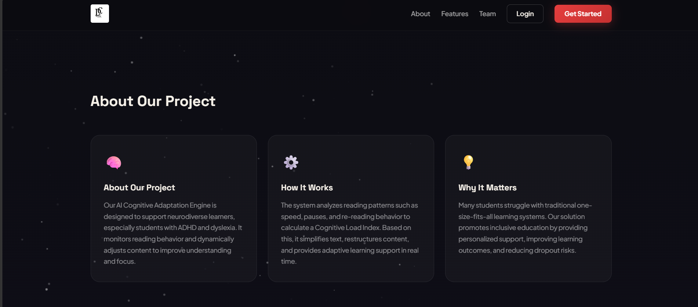
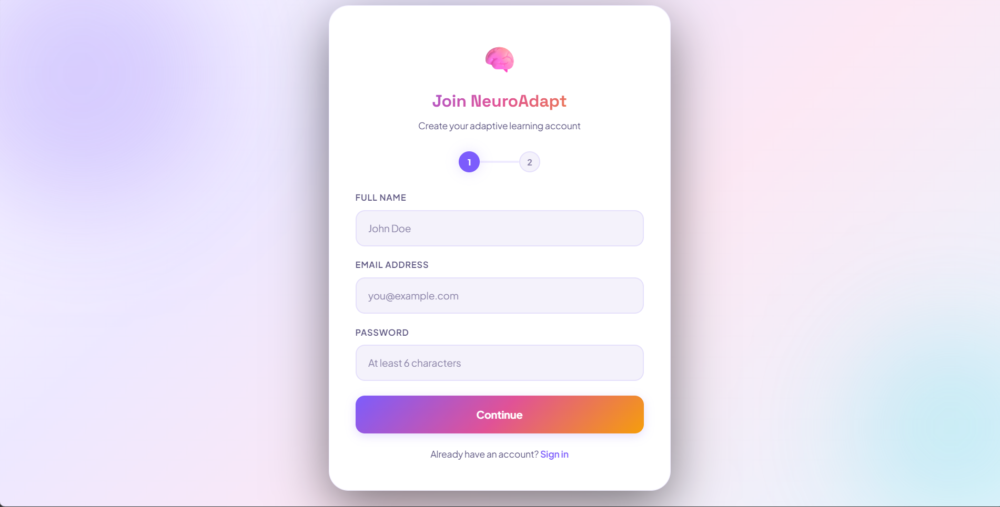
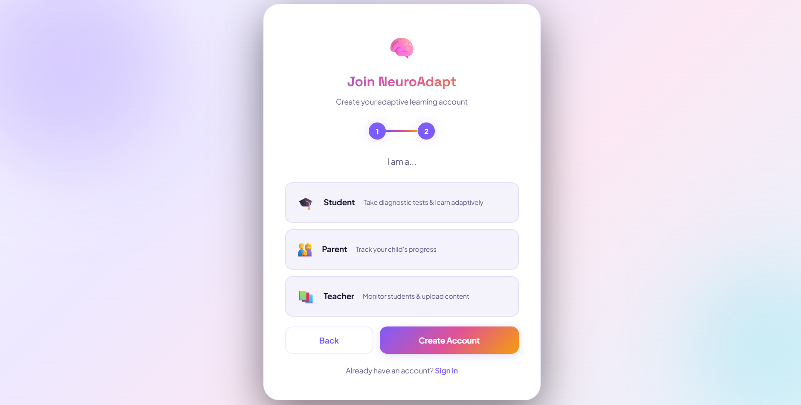
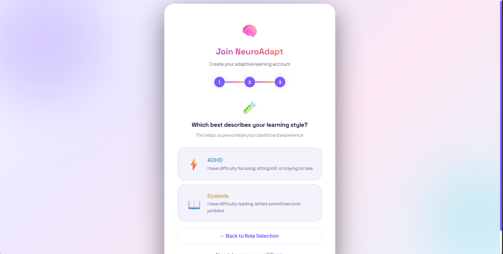
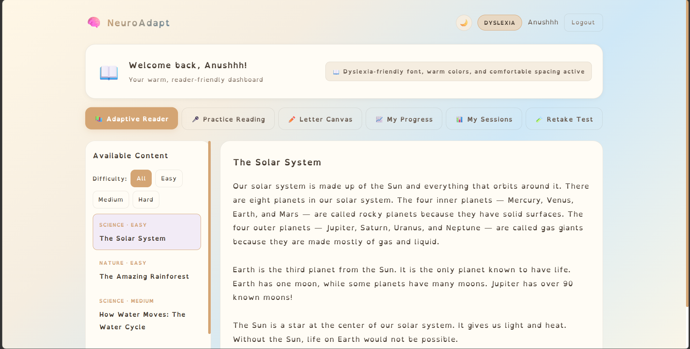
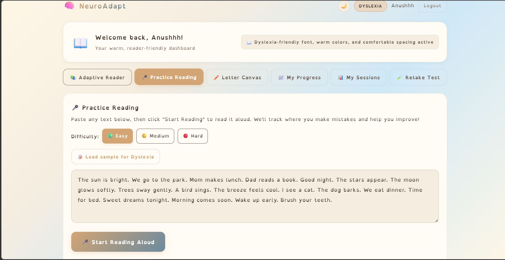
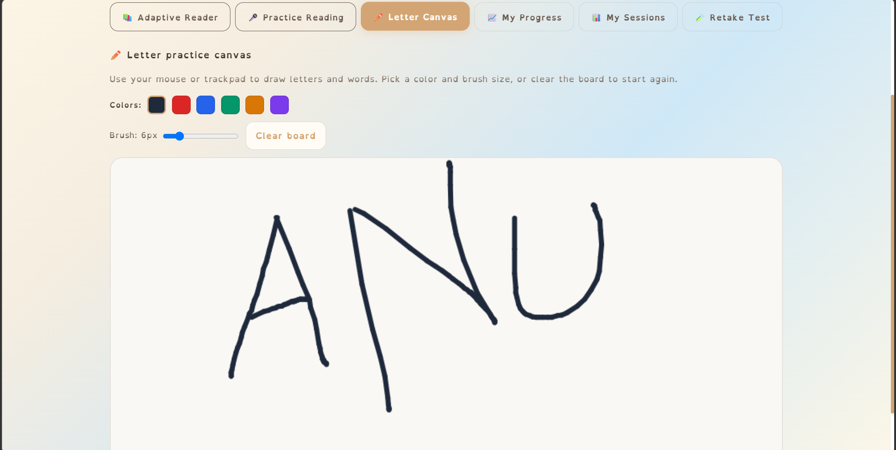
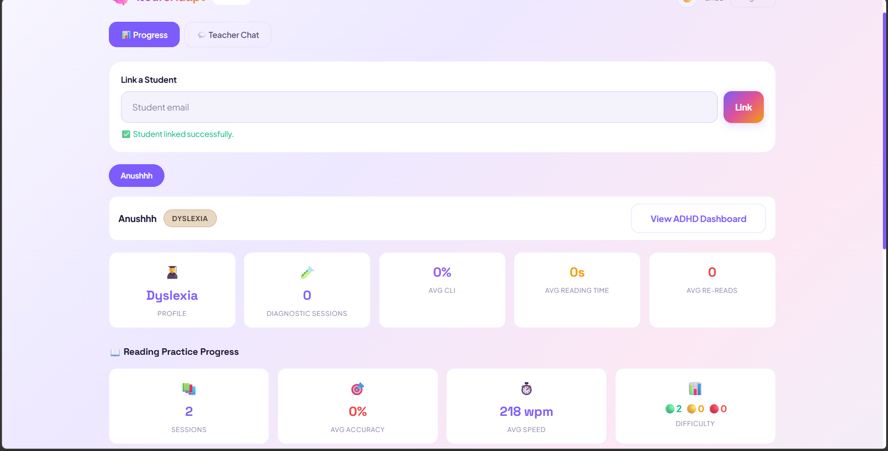
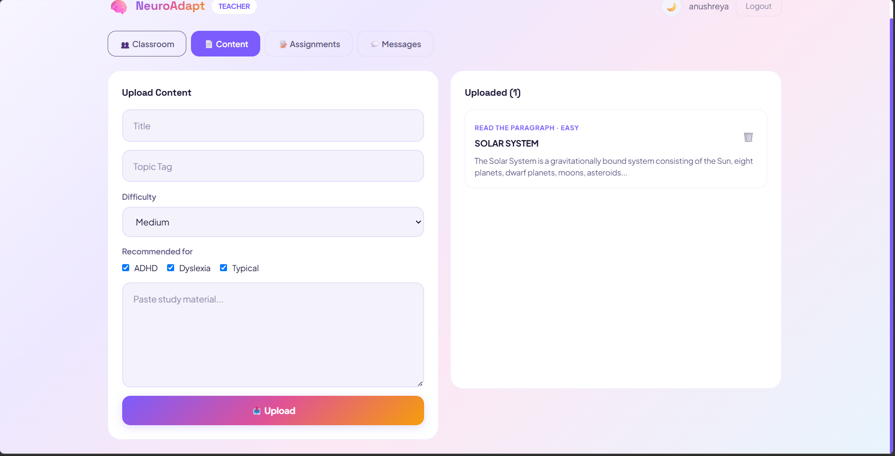

# Cognify

## AI-Powered Adaptive Learning Platform for Neurodiverse Learners

Cognify is an AI-powered learning platform designed to support students with ADHD, Dyslexia, and other learning challenges through adaptive, accessible, and personalized learning experiences.

Many students struggle not because they lack intelligence or motivation, but because traditional educational systems are not designed for the way they process information. Cognify bridges this gap by creating an inclusive environment that adapts to individual cognitive needs and learning styles.

---

## Problem Statement

Traditional learning platforms often rely on text-heavy content, complex interfaces, and one-size-fits-all teaching methods.

Students with ADHD and Dyslexia frequently face challenges such as:

* Information overload
* Difficulty maintaining focus
* Reading-intensive content
* Limited accessibility features
* Lack of personalized learning support

Cognify addresses these challenges through adaptive content delivery, accessibility-focused design, and personalized learning pathways.

---

## Key Features

### Adaptive Learning Experience

* Personalized content presentation based on learner needs
* Reduced cognitive load through simplified interfaces
* Dynamic content adaptation

### Dyslexia-Friendly Learning

* Readability-focused fonts and spacing
* Warm color themes and accessibility enhancements
* Improved reading experience

### ADHD Support

* Structured content organization
* Interactive learning environment
* Focus-oriented learning modules

### Voice-Based Reading Assessment

* Speech recognition integration
* Reading practice with accuracy evaluation
* Performance tracking and improvement analysis

### Letter Canvas

* Interactive handwriting practice board
* Adjustable brush size and colors
* Motor skill development support

### Student Dashboard

* Adaptive reader
* Reading practice modules
* Progress tracking
* Session monitoring

### Parent Dashboard

* Student progress monitoring
* Performance analytics
* Learning activity tracking

### Teacher Dashboard

* Classroom management
* Content uploading
* Assignment creation
* Student performance monitoring
* Parent communication

### Analytics & Progress Tracking

* Reading accuracy statistics
* Words-per-minute analysis
* Session history
* Performance visualization

---

## Screenshots

### Landing Page

### About Project

### User Registration

### Role Selection

### Learning Style Selection

### Main Student Dashboard

### Reading Practice

### Letter Canvas

### Parent Dashboard

### Teacher Dashboard

---

## Technologies Used

### Frontend

* HTML5
* CSS3
* JavaScript

### Backend

* Python

### Tools & Platforms

* Git
* GitHub

### APIs & Libraries

* Web Speech API
* Browser Local Storage

---

## My Contributions

* Frontend Development
* UI/UX Design
* Accessibility-Focused Features
* Dashboard Development
* Feature Integration
* Testing & Debugging
* Team Collaboration

---

## Team Members

* Anushreya Chauhan
* Harshil Gurjar
* Sharan M P
* Suhas Kattimani

---

## Future Scope

* AI-powered personalized learning recommendations
* Advanced analytics and performance prediction
* Speech and language assistance tools
* Enhanced accessibility features
* Mobile application support
* Machine Learning-based cognitive assessment

---

## Impact

Cognify transforms learning from simply being available to being accessible, adaptive, and inclusive.

By combining AI, accessibility, and personalized learning techniques, Cognify empowers neurodiverse learners to learn effectively, confidently, and independently.
